# Amazon_Vine_Analysis (Big Data)

## Purpose
For this project, it's looking at Amazon reviews written by members of the paid Amazon Vine program. With access to approximately 50 datasets from https://s3.amazonaws.com/amazon-reviews-pds/tsv/index.txt, each one contains reviews of a specific product, from clothing apparel to wireless products. Here I've chosen to look at the *sports product category* dataset. 

The purpose of the challenge is to use PySpark to perform the ETL process to extract the dataset, transform the data, connect to an AWS RDS instance, and load the transformed data into pgAdmin. Next, by applying our knowledge of PySpark, Pandas, or SQL, the results are meant to determine if there is any bias toward favorable reviews from Vine members in the dataset. 

## Analysis
In this report, there were many moving pieces that came into play:

1.  Building a database using <b>AWS Management Console</b>. Here we utilized the database services using Amazon RDS to create a new database for the purpose of connecting PostgreSQL. Modifying the inbound and outbound security rules, we allowed PostgreSQL to connect from anywhere.
2.  Next, I opened a new notebook from colaboratory: https://colab.research.google.com/notebooks/welcome.ipynb for the purpose of extracting and transforming our data.
    In the notebook: 
      - it installs Spark and Java
      - uses !wget to download the PostgreSQL driver that will allow Spark to interact with it
      - runs PySpark by starting a new session
      - <i>after everything is in place, this is where the data starts to be pulled in</i>
      - loading the Amazon data into a Spark dataframe; the url is a reflection of the sports dataset I am pulling in
      - SparkFiles enables us to read in the data
      - using `pyspark.sql.functions`, the data can be loaded into a dataframe and the transformation process can begin
      - different dataframes are created to match the tables that will be created in pgAdmin
3.  Switching over to pgAdmin, a new server was created that will use the Amazon RDS endpoint as the host. Then, it's a matter of creating a database that will hold all the different tables to be created. For the purpose of this portion of the challenge, I created a database named "deliverable1". Using the schema provided, four tables were built to reflect its respective columns. 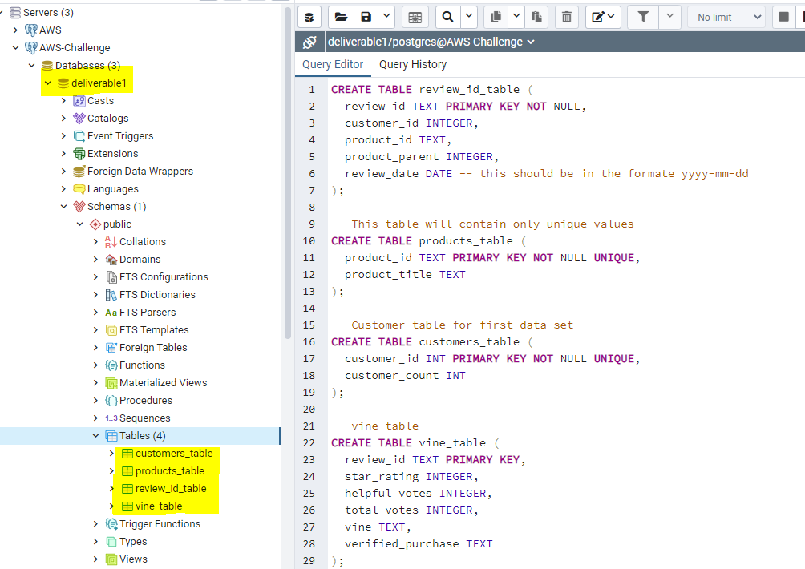 
4.  Toggling back to the notebook, a new code block was written to connect to the AWS RDS instance so that it can write the data/dataframe to its table, and for PostgreSQL(pgAdmin) to view it.
     -  For two of the dataframes, they were able to write to their respective table without issue.  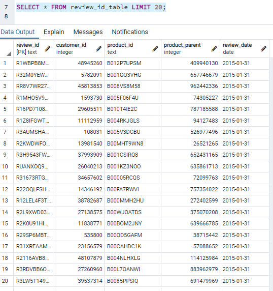 
     -  However, I ran into a few challenges with the remaining two and spent a good majority of time trying to troubleshoot.
     -  For the products_table, I kept receiving an error due to duplicate values. However, within the code, I had included .drop_duplicates() - so I was unsure of how I was getting that error. So I tried trimming the product_id and product_title, in case there was white space being accounted. However, that still provided me errors. So, next I wanted to check which values and how many were actually hitting as a duplicate. So I ran a code block to check those counts and sure enough, I had at least two product ids that had either 354 duplicates or 404 dupes. In order to fix this I had to add subset in my code `.drop_duplicates(subset = ["product_id"])`
     -  Running my dupes check again, it was only showing one instance of the product_id and was able to write into the table. 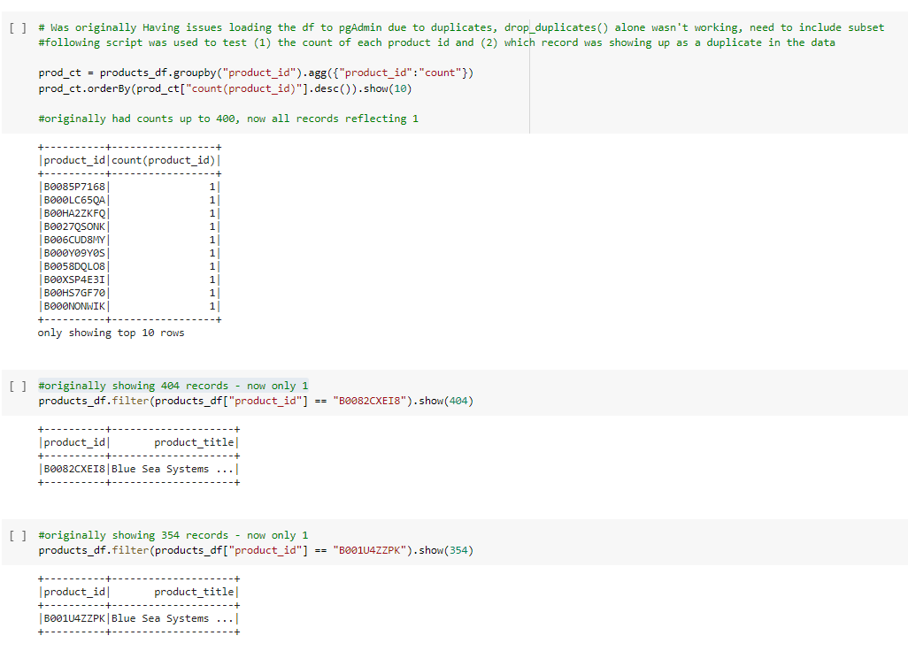 
        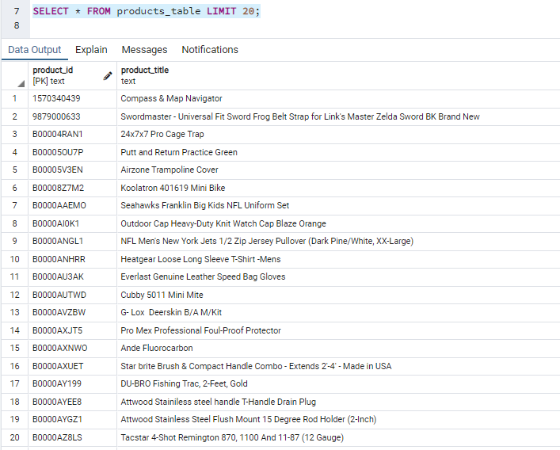
     -  Next, I was having issues related to the vine_table about datatypes mismatching. So I applied to the following as part of troubleshoot: 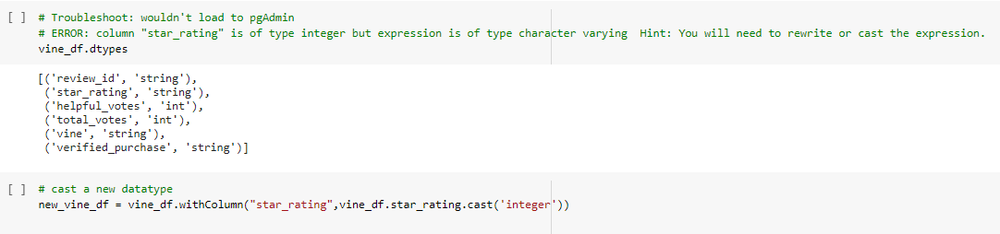 
        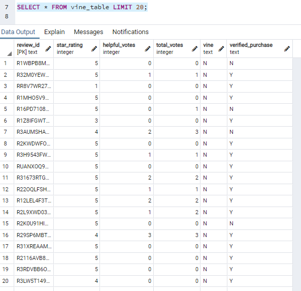
5.    With all the dataframes writing into the tables in AWS RDS, it's now available to be queried and formulate an analysis/reporting of the results in pgAdmin.

---- 
## Results
Using our knowledge of PySpark, Pandas, or SQL, we needed to determine if there was any bias towards reviews that were written as part of the Vine program. For this analysis,
I choose SQL to continue with the reporting.

By choosing SQL, I did the following: (1) exported the vine_table from the "deliverable1" database as a csv file (2) created a new database in my localhost called "postgres" (3) using the same schema, built a new vine_table (4) imported the newly created csv file (5) ran the queries noted below.

In the original dataset (vine_table), there were a total of 4,850,360 sports reviews. In order for the data to be helpful, filtering was applied to look at total_votes equal (=) or greater than (>) 20 in order to avoid division errors with zeros (total of 67,855 reviews). Next, the dataset was further filtered to show where the ratio of helpful_votes to total_votes was at least half (50%) or more. As such, the remaining 61,948 reviews were subject for analysis.

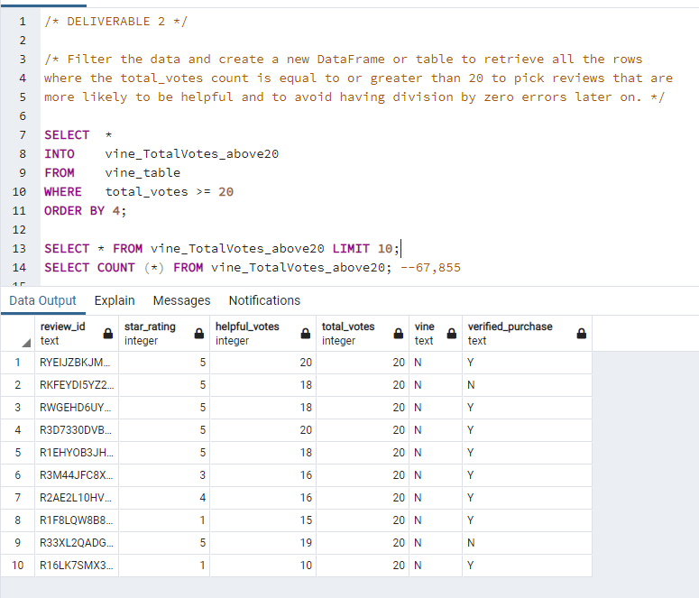
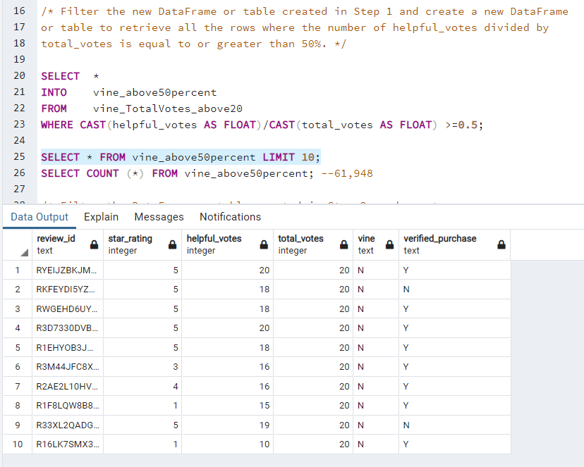

Next, using this filtered dataset and SQL queries, the aim is to answer the following questions: 
1. <i><b>How many Vine reviews (PAID) and non-Vine reviews (UNPAID) were there?</i></b> 
    Of the 61,948 reviews, **334** were paid vine reviews whereas the remaining **61,614** reviews were unpaid non-vine reviews. 
    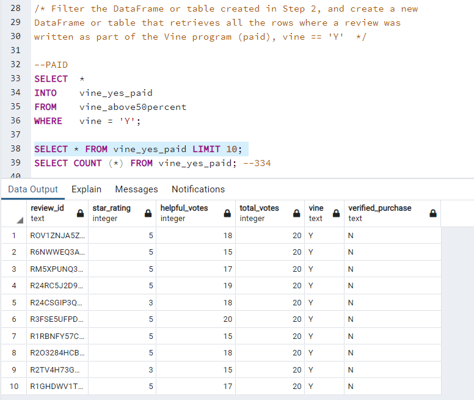
    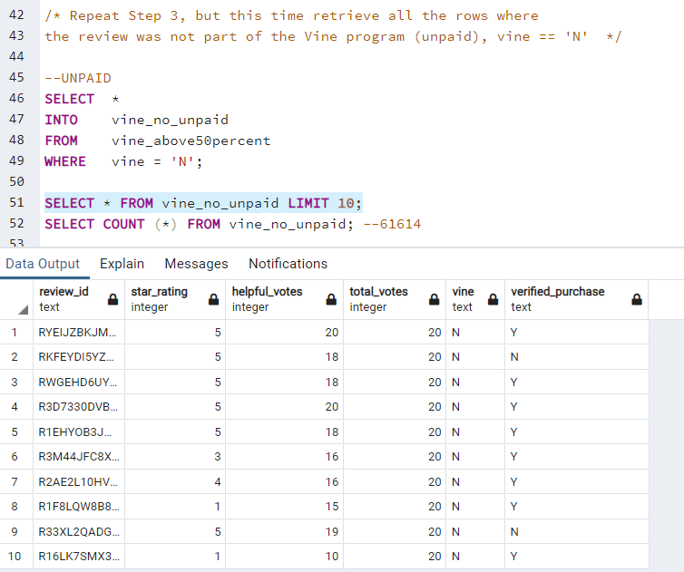
     
2. <i><b>How many Vine reviews were 5 stars? How many non-Vine reviews were 5 stars?</i></b> 
    **139** paid vine reviews were 5 stars, while **32,665** unpaid non-vine reviews were 5 stars.

3. <i><b>What percentage of Vine reviews were 5 stars? What percentage of non-Vine reviews were 5 stars?</i></b> 
    Based on the 334 paid Vine reviews, 42% (139 reviews) were identified as a 5 star review. Concurrently, of the 61,614 unpaid non-Vine reviews, 53% (32,665 reviews) were identified as a 5 star review.  
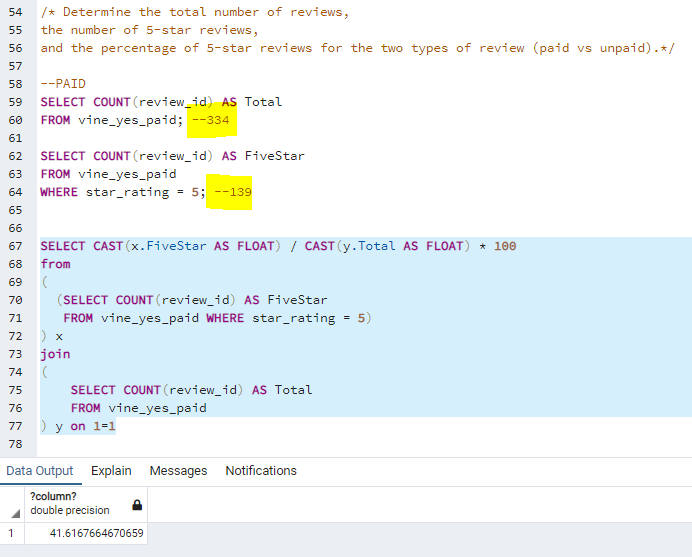
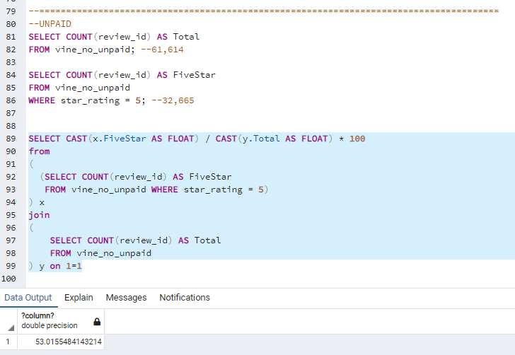

## Summary

Based on the results of the queries and solely comparing the percentage of 5-star reviews between Vine and non-Vine, we can assume that a positivity bias for reviews in the Vine program **do not exist**. In fact, the 42% of 5-star paid Vine reviews is about 11% less than the 53% of 5-star unpaid non-Vine reviews. With the lower percentage, there is no indicator of bias. 

However, I think it's important to consider that of the <i><b>61,948 total reviews</i></b>, 99.5% of the dataset was bucketed as an unpaid non-Vine review. The other 0.5% (the 334 paid Vine reviews) was subject for our reporting. Hence, it's difficult to make a sounding conclusion about the data.

Further, I think in order to strengthen the conclusion if a positivity bias exists, we could do a few things. One, I think we can gather more data related to paid Vine reviews or filter the unpaid non-Vine reviews. Either way, I think it's necessary to have similar sample sizes of the two different buckets. Also, we could check if similar percentages exist across all the star reviews (i.e. 4-star, 3-star, etc.) to detect for other possible positivity bias.

---- 
## Challenges

* Uploading the `vine_table.csv` file to the Github repository was causing an issue. 

Due to the size of the csv file, I originally tried to push it to the repository using `git lfs track "*.csv` and was prompted with the following error:
 
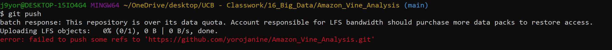
It seems that I had exceeded the data quota and didn't want to purchase extra space. As a solution, I tried reaching out to one of the teaching instructors to come up with a work-around. The following notes the steps we took to resolve the issue:
 
   1. Tried deleting older csv files from previous modules to free up space. The file deleted but there was no change to the amount of storage available.
   2. Tried to reclone this old repository (now without the previous csv file). Using `ls -a` it showed that .gitattributes was still in the repository, which explains why there was no change in storage. So the next line of action was to try and remove the .gitattributes to remove the lfs tracking.
        - tried using `git lfs uninstall` and then `git push` to update the repository; but this didn't work
        - source https://docs.github.com/en/enterprise-server@2.21/github/managing-large-files/removing-files-from-git-large-file-storage
        - since that didn't work, the next option was to try the BFG Repo-Cleaner (source: https://rtyley.github.io/bfg-repo-cleaner/)
                - I had to download the BFG Repo-Cleaner, but it downloaded as a .`jar` file & I didn't have a system to open a `.jar` file
                - So I downloaded WinRAR to try and open the jar file (https://www.win-rar.com/downloadond.html?&L=0)
                - I was able to open the jar file, but the .`exe` was unavailable to install the BFG Repo-Cleaner
                - So, it was back to finding a different solution
        - The next step was trying to remove the contents of the .gitattributes file, so I navigated to the file through vs code to open the .gitattributes file.
                - In the file, I deleted all the contents to untrack the lfs of this old csv file
                - tried to [push everything back](https://github.com/yorojanine/Amazon_Vine_Analysis/blob/main/resources/vscode_step.PNG) to the repository, but still no change to the storage space 
        -  Tried using filter-branch & that made no impact to the storage space issue.
   3.   It seemed that all the options were exhausted and was unable to free up any space in my github repository to ultimately upload my `vine_table.csv`
   

As a solution: I have **temporarily** made the csv file available using the Amazon S3 service, with the file available for download here:
https://janineyoro-bucket.s3.amazonaws.com/vine_table.csv

### Note for the grader: Please advise if a resubmission is necessary to complete the challenge.
