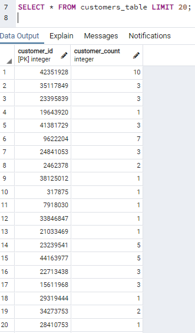

# Amazon_Vine_Analysis (Big Data)

## Purpose
For this project, it's looking at Amazon reviews written by members of the paid Amazon Vine program. With access to approximately 50 datasets from https://s3.amazonaws.com/amazon-reviews-pds/tsv/index.txt, each one contains reviews of a specific product, from clothing apparel to wireless products. Here I've chosen to look at the *sports product category* dataset. 

The purpose of the challenge is to use PySpark to perform the ETL process to extract the dataset, transform the data, connect to an AWS RDS instance, and load the transformed data into pgAdmin. Next, by applying our knowledge of PySpark, Pandas, or SQL, the results are meant to determine if there is any bias toward favorable reviews from Vine members in the dataset. 

## Analysis
In this report, there were many moving pieces that came into play:

1.  Building a database using <b>AWS Management Console</b>. Here we utilized the database services using Amazon RDS to create a new database for the purpose of connecting PostgreSQL. Modifying the inbound and outbound security rules, we allowed PostgreSQL to connect from anywhere.
2.  Next, I opened a new notebook from colaboratory: https://colab.research.google.com/notebooks/welcome.ipynb for the purpose of extracting and transforming our data.
    In the notebook: 
      - it installs Spark and Java
      - uses !wget to download the PostgreSQL driver that will allow Spark to interact with it
      - runs PySpark by starting a new session
      - <i>after everything is in place, this is where the data starts to be pulled in</i>
      - loading the Amazon data into a Spark dataframe; the url is a reflection of the sports dataset I am pulling in
      - SparkFiles enables us to read in the data
      - using `pyspark.sql.functions`, the data can be loaded into a dataframe and the transformation process can begin
      - different dataframes are created to match the tables that will be created in pgAdmin
3.  Switching over to pgAdmin, a new server was created that will use the Amazon RDS endpoint as the host. Then, it's a matter of creating a database that will hold all the different tables to be created. For the purpose of this portion of the challenge, I created a database named "deliverable1". Using the schema provided, four tables were built to reflect its respective columns.  
4.  Toggling back to the notebook, a new code block was written to connect to the AWS RDS instance to PostgreSQL so that it can write the data/dataframe to its table.
     -  For two of the dataframes, they were able to write to their respective table without issue.   
     -  However, I ran into a few challenges with the remaining two and spent a good majority of time trying to troubleshoot.
     -  For the products_table, I kept receiving an error due to duplicate values. However, within the code, I had included .drop_duplicates() - so I was unsure of how I was getting that error. So I tried trimming the product_id and product_title, in case there was white space being accounted. However, that still provided me errors. So, next I wanted to check which values and how many were actually hitting as a duplicate. So I ran a code block to check those counts and sure enough, I had at least two product ideas that had either 354 duplicates or 404 dupes. In order to fix this I had to add subset in my code `.drop_duplicates(subset = ["product_id"])`
     -  Running my dupes check again, it was only showing one instance of the product_id and was able to write into the table.  
        
     -  Next, I was having issues related to the vine_table about datatypes mismatching. So I applied to the following as part of troubleshoot:  
        
5.    With all the dataframes writing into the pgAdmin tables, it's now available to be queried and formulate an analysis/reporting of the results.

---- 
## Results
Using our knowledge of PySpark, Pandas, or SQL, we needed to determine if there was any bias towards reviews that were written as part of the Vine program. 

In the original dataset (vine_table), there were a total of 4,850,360 sports reviews. In order for the data to be helpful, filtering was applied to look at total_votes equal (=) or greater than (>) 20 in order to avoid division errors with zeros. Next, the dataset was further filtered to show where the ratio of helpful_votes to total_votes was at least half (50%) or more. As such, the remaining 61,948 reviews were subject for analysis.

Next, using this filtered dataset and SQL queries, the aim is to answer the following questions: 
1. <i>How many Vine reviews (PAID) and non-Vine reviews (UNPAID) were there?</i> 
    Of the 61,948 reviews, 334 were paid vine reviews whereas the remaining 61,614 reviews were unpaid non-vine reviews. 

2. 

How many Vine reviews were 5 stars? How many non-Vine reviews were 5 stars? 
What percentage of Vine reviews were 5 stars? What percentage of non-Vine reviews were 5 stars?</i>

## Summary
Summary: In your summary, state if there is any positivity bias for reviews in the Vine program. Use the results of your analysis to support your statement. Then, provide one additional analysis that you could do with the dataset to support your statement.
